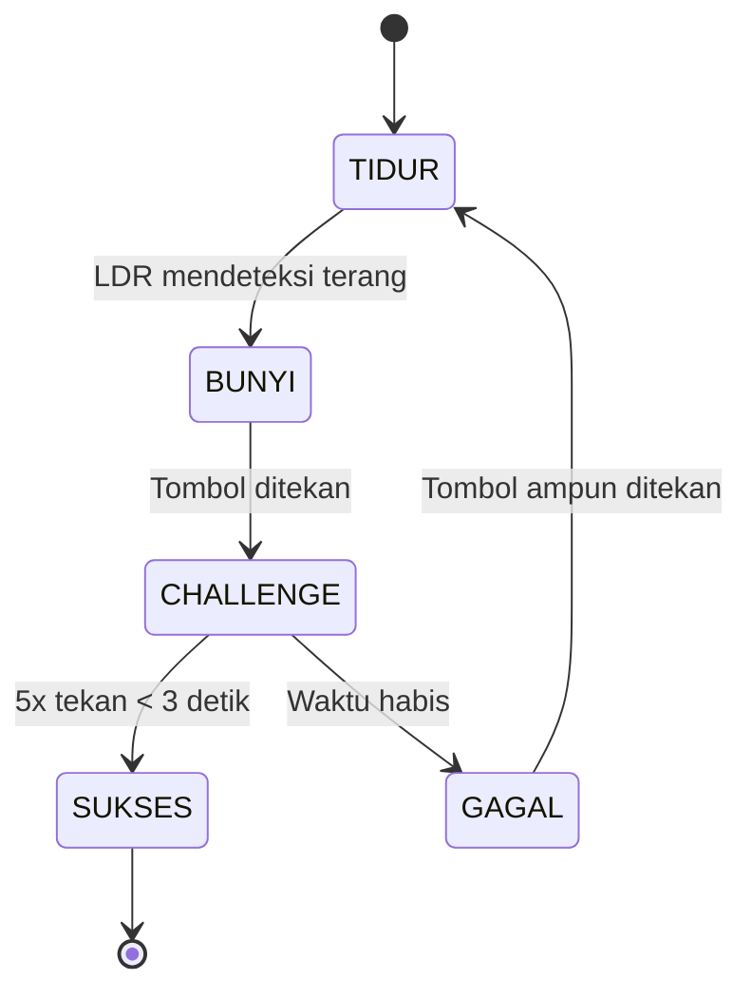

---

# 🕹️ Proyek "ANTI-SANTUY" – Alarm Pintar Berbasis ESP32

> 🚨 *Bangun pagi gak bisa santai-santai lagi!*
> Sistem alarm yang **tidak akan berhenti berbunyi** sampai kamu benar-benar bangun dan lolos *challenge* fisik sederhana 😎

---

## 📜 Deskripsi Proyek

**ANTI-SANTUY** adalah proyek kreatif berbasis **ESP32** yang berfungsi sebagai *alarm interaktif* dengan sistem *challenge*.
Ketika cahaya pagi (terdeteksi oleh sensor LDR), sistem akan membunyikan alarm (buzzer).
Kamu hanya bisa mematikan alarm dengan **menekan tombol sebanyak 5 kali dalam 3 detik!**

Jika gagal, ESP32 akan menghukummu dengan **LED hukuman dan buzzer ejekan** — sampai kamu menekan tombol “ampun” lagi.

Proyek ini cocok untuk:

* Mahasiswa yang sering kesiangan 😴
* Eksperimen fun dengan *state machine logic*
* Pembelajaran sensor dan aktuator dasar (LDR, tombol, buzzer, LED)

---

## ⚙️ Fitur Utama

| Fitur                             | Deskripsi                                                                           |
| --------------------------------- | ----------------------------------------------------------------------------------- |
| 🌙 **Mode Tidur (TIDUR)**         | ESP32 standby sambil memantau kondisi LDR.                                          |
| 🌞 **Deteksi Fajar (BUNYI)**      | Saat LDR mendeteksi cahaya, alarm otomatis menyala (buzzer aktif).                  |
| 🎯 **Mode Tantangan (CHALLENGE)** | Pengguna harus menekan tombol 5 kali dalam 3 detik untuk mematikan alarm.           |
| 💀 **Mode Gagal (GAGAL)**         | Jika challenge gagal, buzzer dan LED hukuman menyala (plus ASCII ejekan di serial). |
| 🏆 **Mode Sukses (SUKSES)**       | Jika challenge berhasil, alarm mati dan sistem berhenti total (ASCII senang).       |

---

## 🔌 Komponen yang Dibutuhkan

| Komponen                                    | Keterangan                                 |
| ------------------------------------------- | ------------------------------------------ |
| 🧠 ESP32 Dev Board                          | Mikrokontroler utama                       |
| 🌞 Sensor LDR (dengan modul digital output) | Deteksi cahaya (terang/gelap)              |
| 🔊 Buzzer aktif                             | Alarm                                      |
| 💡 LED                                      | Hukuman visual                             |
| 🔘 Push Button                              | Untuk snooze/challenge                     |
| ⚙️ Resistor 10kΩ (opsional)                 | Jika perlu *pull-up eksternal* pada tombol |
| 🔋 Breadboard & Kabel jumper                | Perakitan                                  |

---

## 🧩 Diagram Pin (ESP32)

| Komponen | Pin ESP32 | Mode   |
| -------- | --------- | ------ |
| LDR DO   | `GPIO 34` | Input  |
| LED      | `GPIO 13` | Output |
| Buzzer   | `GPIO 18` | Output |
| Button   | `GPIO 19` | Input  |

---

## 🧠 Alur Logika (State Machine)



---

## 💻 Cara Kerja Singkat

1. **ESP32 menyala → Mode TIDUR.**
   Menampilkan ASCII “tidur” di serial monitor, memantau sensor LDR.

2. **LDR mendeteksi cahaya (pagi tiba).**
   Alarm (buzzer) aktif, ASCII “kaget” muncul di serial monitor.

3. **Tekan tombol → Masuk Mode CHALLENGE.**
   Kamu harus menekan tombol **5 kali dalam 3 detik**.

4. **Jika berhasil:**
   Alarm mati total, muncul ASCII “senang”.

5. **Jika gagal:**
   LED dan buzzer menyala terus (hukuman), sampai kamu tekan tombol “ampun”.

---

## 🧰 Konfigurasi Parameter

| Variabel             | Default | Fungsi                                 |
| -------------------- | ------- | -------------------------------------- |
| `LDR_TRIGGER_STATE`  | `LOW`   | Kondisi logika dari sensor saat terang |
| `PRESSES_NEEDED`     | `5`     | Jumlah tekan yang dibutuhkan           |
| `CHALLENGE_DURATION` | `3000`  | Durasi challenge (ms)                  |

---

## 🎨 ASCII Mode (Output di Serial Monitor)

| Status      | Emoji ASCII    |
| ----------- | -------------- |
| Tidur       | 💤 `( - . - )` |
| Alarm Bunyi | 😱 `( o . o )` |
| Challenge   | 😤 `( o _ o )` |
| Gagal       | 😆 `( > . < )` |
| Sukses      | 😄 `( ^ . ^ )` |

---

## 🚀 Cara Menggunakan

1. Upload kode ke ESP32 via Arduino IDE.
2. Buka **Serial Monitor (115200 baud)**.
3. Pastikan sensor LDR terhubung dengan benar.
4. Tutup sensor → gelap (tidur).
5. Arahkan ke cahaya → alarm bunyi.
6. Tekan tombol 5x cepat untuk mematikan alarm.

---

## 🧪 Debugging Tips

* Jika buzzer **tidak berhenti**, pastikan logika LDR (`LOW`/`HIGH`) sesuai dengan modul yang digunakan.
* Jika tombol tidak terbaca, coba aktifkan `INPUT_PULLUP` di pin tombol.
* Cek delay debouncing (`debounceDelay`) bila tombol terlalu sensitif.

---

## 👨‍💻 Tentang Proyek

* **Judul:** Alarm ANTI-SANTUY
* **Tim:** Techsis
* **Versi:** v2.4 ASCII_ART
* **Platform:** ESP32 + Arduino IDE
* **Bahasa:** C++ (Arduino Framework)

---

## 📜 Lisensi

Proyek ini bersifat **Open Source** untuk tujuan edukasi.
Silakan dimodifikasi, dikembangkan, dan dipamerkan — asal tetap menyertakan kredit ke **Techsis** ✨

---

## ❤️ Preview (Serial Output)

```
=================================
STATUS: ALARM BUNYI!
   /\_/\
  ( o . o )
   >  V  <
BNGUUN!! (Tekan tombol!)
=================================
```

---

Apakah kamu ingin saya tambahkan **bagian wiring diagram (dalam bentuk gambar Fritzing/ASCII schematic)** juga di README-nya biar makin lengkap?
